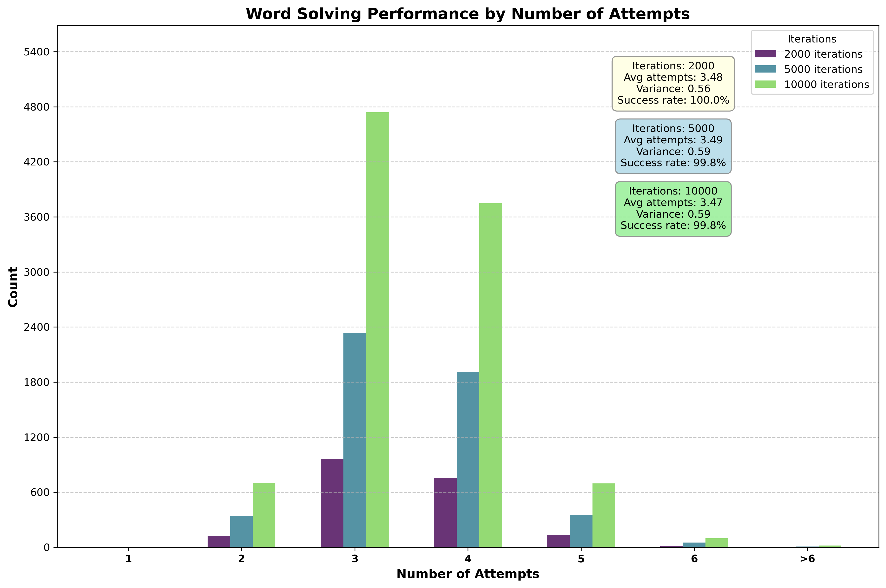

# Parole-bot Documentation

## Introduction

Parole-bot is a terminal-based application designed to solve the Italian version of the popular word-guessing game "Wordle" ([Italian wordle project](https://pietroppeter.github.io/wordle-it/)). Using principles from information theory, the solver strategically identifies optimal word candidates to minimize the number of attempts required to discover the target word.

## Architecture

Parole-bot is built with a modular architecture consisting of three primary components:

- **TUI (Terminal User Interface):** A responsive interface built with the Ratatui library that allows users to interact with the application, enter guessed words, and mark the color feedback (Green/Yellow/Red).
- **Solver Engine:** The core algorithm that analyzes feedback patterns and calculates optimal word suggestions using information entropy.
- **Word Database:** A curated collection of Italian five-letter words with frequency data to improve suggestion quality.

## Solver Implementation Details

### Information Theory Foundation

The solver implements an entropy-based approach to word selection, using Claude Shannon's information theory principles to quantify how much information each potential guess would provide.

### Entropy Calculation

For each potential guess word, the algorithm:
- **Simulates all possible color feedback patterns** against remaining candidate words.
- **Builds a probability distribution** of these patterns.
- **Calculates the information entropy** using the formula:  
  *Entropy = - Σ p(x) log p(x)*  
  where *p(x)* is the probability of a particular feedback pattern occurring.

Words that result in higher entropy values are prioritized as they provide more information regardless of the actual target word.

### Constraint Satisfaction

The solver maintains three types of constraints from previous guesses:
- **Green Constraints (accumulated_present_chars):** Letters in correct positions.
- **Yellow Constraints (accumulated_wrong_placed_chars):** Letters present but in wrong positions.
- **Red/Black Constraints (accumulated_absent_chars):** Letters not present in the word.

Each new guess adds to these accumulated constraints, progressively narrowing the search space. This implementation handles the significant edge case where a letter might be absent in one position but present in another.

### Word Filtering Process

After each guess, the solver filters the word list using a three-step process:
1. **Filter by absent letters:** Eliminates words containing any letter marked as absent.
2. **Filter by correct positions:** Ensures words contain all correctly placed letters.
3. **Filter by misplaced letters:** Ensures words contain all yellow letters but not in the positions where they were marked.

## Word Selection Algorithm

The selection algorithm balances information gain with word frequency:
- **Filter candidate words** based on all accumulated constraints.
- **Calculate entropy** for each remaining candidate.
- **Tiebreaker:** For words with similar entropy values (difference < 0.05), use word frequency to favor more common words.
- **Sort words** by this composite score.
- **Return suggestions:** The highest-scoring words are presented as suggestions.

This approach yields a powerful balance between theoretical information gain and practical likelihood of being the target word.

## Features

- **Interactive TUI:** Clean, keyboard-driven interface with color coding.
- **Multi-threaded Calculation:** Background processing for a responsive UI.
- **Best Opening Word Finder:** Pre-calculates optimal starting words.
- **Word Frequency Integration:** Considers real-world word frequency when suggestions have similar entropy.
- **Constraint Accumulation:** Tracks and applies all constraints from previous guesses.
- **Persistence:** Remembers previously used words to avoid repetition.
- **Visual Feedback:** Shows top suggestions with entropy values.

## Implementation

The application is written in Rust, leveraging:
- **Ratatui:** Terminal UI framework.
- **Crossterm:** Terminal manipulation and event handling.
- **Standard Library:** Multithreading and concurrency primitives.

### Key Implementation Highlights

- **Memory Safety:** Leverages Rust's ownership model for robust design.
- **Thread Management:** Uses channels for communication between UI and solver threads.
- **Error Handling:** Comprehensive error tracking and recovery mechanisms.
- **Performance Optimization:** Efficient algorithms for entropy calculation and word filtering.

## Usage

Start the application by running:
```bash
cargo run --bin tui-app #This will run the TUI application
```
### Modes
The application provides different modes:
1. **Normal Mode**
2. **Editing tile char mode**: In this mode the user can insert the chosen word's chars inside the tiles.
    - The user can use these commands to interact:
        - (↑/↓/←/→) arrows: Move the cursor between tiles
        - (A-Z) letters: Insert the chosen char in the current position.
        - Enter: Go to the next row
        - Backspace: Delete the char in the current position.
        - Esc: Exit the mode.
3. **Editing tile color mode**: In this mode the user can insert the chosen word's colors inside the tiles to provide the color code.
    - The user can use these commands to interact:
        - (↑/↓/←/→) arrows: Move the cursor between tiles
        - N: Move to the next color in the sequence
        - P: Move to the previous color in the sequence
        - Enter: Send the word and the color code to the solver.
        - Esc: Exit the mode.
4. **Exiting mode**

When a couple (*word*, *color code*) is sent to the solver, the solver will provide the best three words to guess next.
Repeat the steps until the word is found.

## Evaluation and Performance

The solver demonstrates a high success rate, typically identifying the target word within 3-4 attempts. This performance has been rigorously evaluated through statistical analysis across large word samples.

### Performance Analysis

A simulation module is provided in the `simulations` directory to quantify solver effectiveness through controlled testing:

#### Running Performance Simulations

```bash
cargo run --bin simulations -- -f <path_to_output_csv_file> -i  <iterations>
```

An example command to run 2000, 5000 and, 10000 iterations would be:
```bash
cargo run --bin simulations -- -f results/result.csv -i  2000 5000 10000
```

### Plotting the results
In the same directory, there is a python script that can be used to plot the results. To run the script, use the following command:
```bash
python plot_results.py -f <path_to_output_csv_file>
```
An example of the command is:
```bash
python plot_results.py -f results/output.csv
```
The script will plot the results saved in the file specified in the `-f` flag. 


*An example running three simullations with 2000, 5000 and, 10000 iterations respectively*


## Possible Enhancements
- Language expansion to support additional word lists
- Local scoring history and statistics
- Improved visualization of entropy distribution
- Custom wordlist support